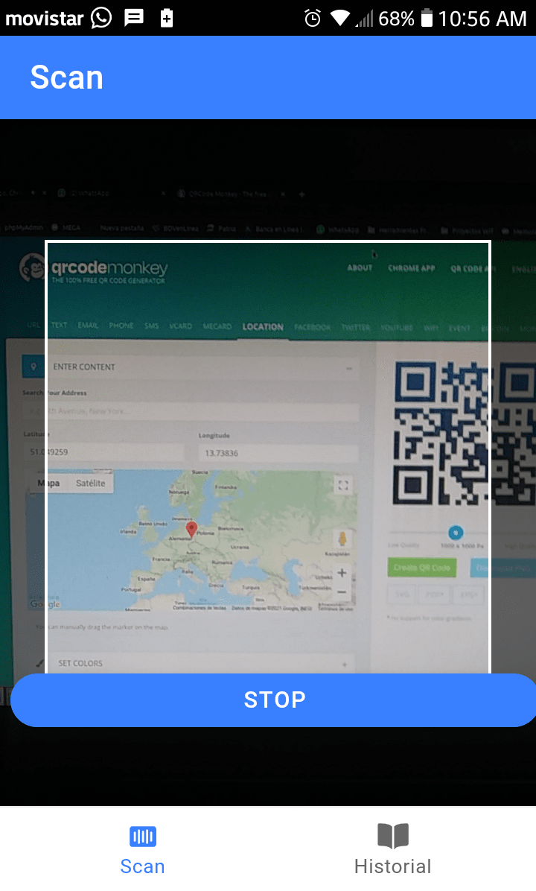
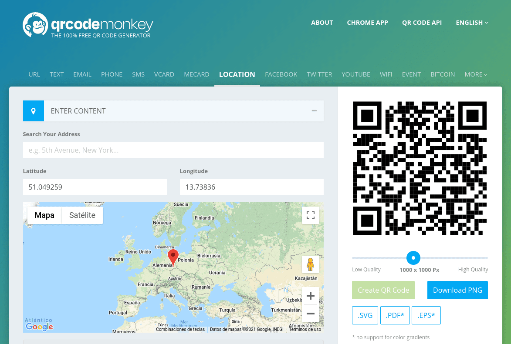
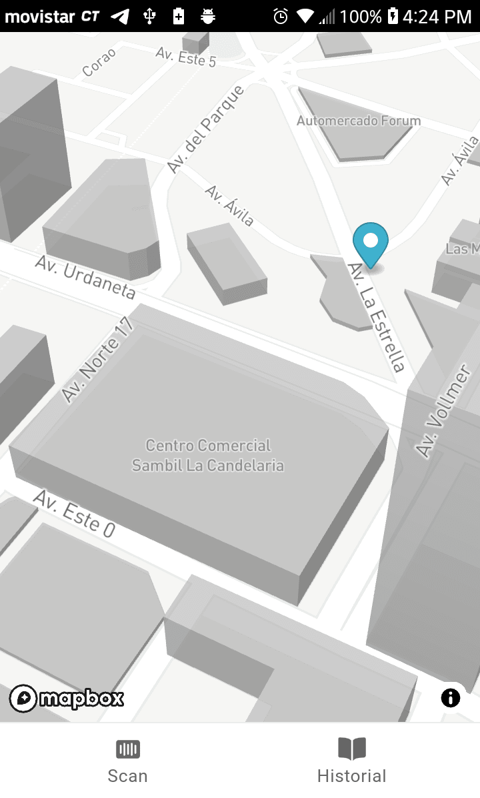
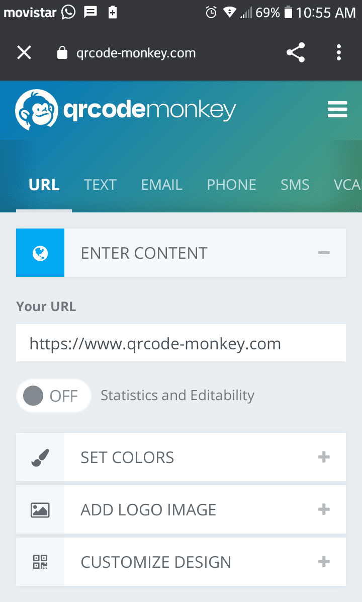
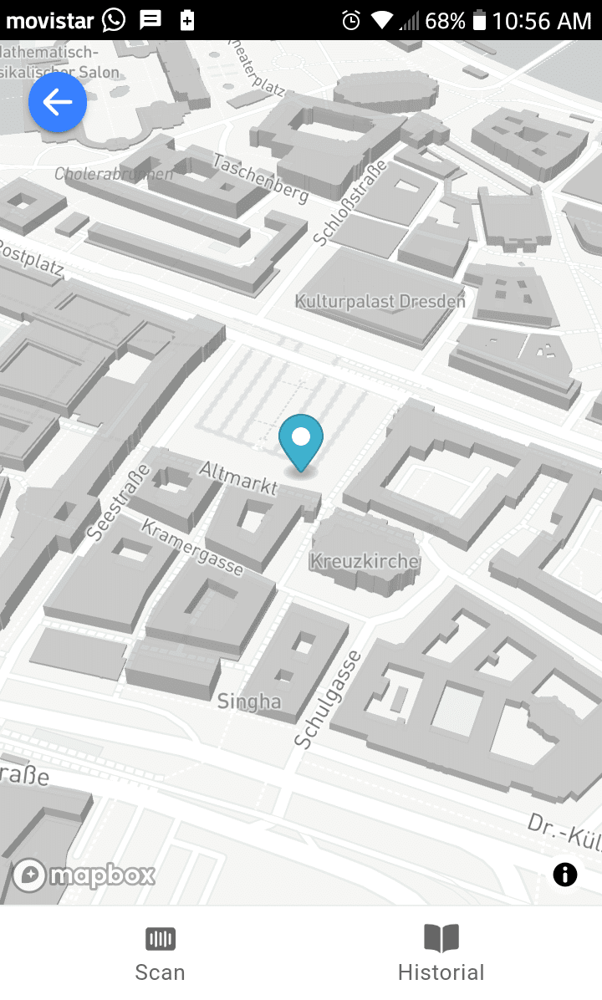
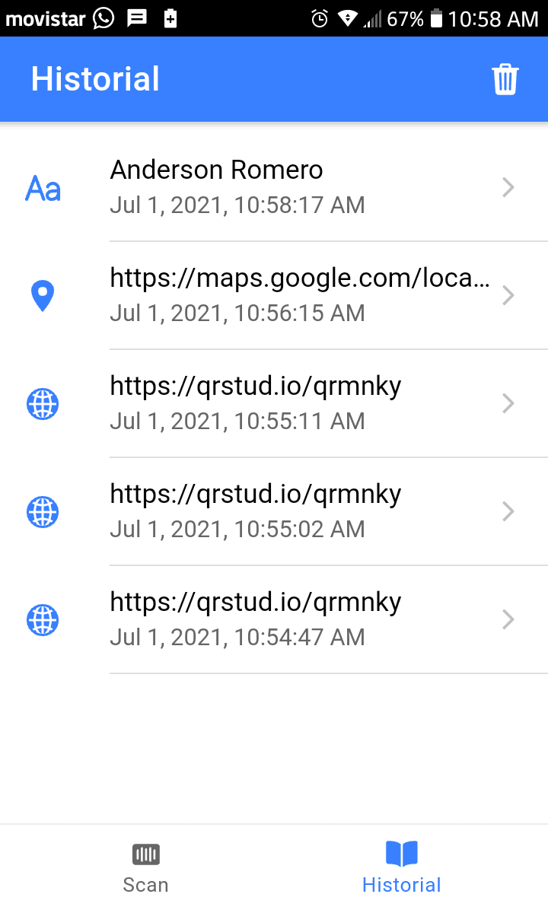

# barcode-scanner-ionic
Application that allows to scan QR or barcode, has scan history, internal browser, that is if you scan a URL the application opens the built-in browser. Geolocation scan and display location via Mapbox (in 3D). This application is made with the Capacitor plugin. 

  
 

  
 

